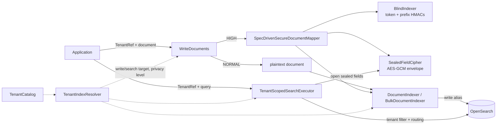

# opensearch-java-toolkit

[](https://github.com/dcano/opensearch-java-toolkit/actions/workflows/publish.yml)


A domain-neutral, multi-tenant search toolkit for OpenSearch: control plane, write path, field-level
encryption with blind indexes, tenant-scoped search execution and index provisioning — with no
application vocabulary anywhere in it.

## Overview

Building multi-tenant search on a shared cluster means solving the same problems for every
application: where a tenant's documents live, how to stop one tenant reading another's, how to keep
sensitive values unreadable to the cluster while still searchable, and how to provision indices
that agree with the code that writes to them. This toolkit solves them once.

An application contributes a `SearchDomain` name (e.g. `orders`), its document type and its
mappings. Every index, alias, template and lifecycle-policy name is **derived** from that domain —
the toolkit never names an index literally — and every safety rule (tenant filter, privacy family,
fail-closed crypto) is enforced in final classes an application holds rather than extends.

It is aimed at Java teams running a shared OpenSearch cluster for many tenants, some of whom
require that sensitive fields never reach the cluster in readable form.

## Features

- **Tenant placement** — tenants start in hashed shared pools and can be promoted to a dedicated
  index (`TenantTierMigrator`) or moved between pools (`PoolReassigner`) without a read outage.
- **Two privacy families per domain** — `NORMAL` tenants store values readable; `HIGH` tenants live
  in a `<domain>-secure-*` family whose mapping defines no plaintext field at all.
- **Envelope encryption** — per-document AES-256-GCM data keys wrapped by a per-tenant KEK, bound to
  `(tenant, documentId, field)` as associated data so envelopes cannot be moved between documents.
- **Blind indexes** — HMAC-SHA256 (truncated to 160 bits) per token and per 4–12 character prefix,
  giving equality and type-ahead search over values the cluster cannot read.
- **Mandatory tenant scoping** — `TenantScopedSearchExecutor` wraps every query in a tenant filter
  (filter context, never scoring) with routing; there is no hook to bypass it.
- **Match provenance** — each hit reports whether it matched on `CONTENT` or on a sensitive
  `IDENTIFIER`, via named queries.
- **Identifier-probe controls** — per-tenant rate limiting (Resilience4j, default 30/minute) and a
  dedicated audit logger (`audit.identifier-search`) for sensitive-identifier searches.
- **Backpressure-aware bulk indexing** — on `429` the indexer backs off exponentially *and* shrinks
  the batch.
- **Provisioning** — composable index templates for both families (priorities 100/200), ISM
  lifecycle policies from application-supplied JSON, and idempotent pool creation.
- **Observability** — Micrometer observations and meters (`opensearch.search.*`,
  `opensearch.bulk.*`) tagged with low-cardinality values only; sensitive values never appear.
- **Conformance testkit** — a JUnit 5 dynamic-test suite that a domain module runs against a real,
  security-enabled OpenSearch container to prove it wired the toolkit correctly.

## Modules

| Module | Artifact | Purpose |
|---|---|---|
| Core | `opensearch-java-toolkit-core` | Contracts (`SearchDomain`, `TenantRef`, `TenantDocument`, `SecureFieldSpec`, `IndexNames`, `SearchResults`) and crypto (`SealedFieldCipher`, `BlindIndexer`, `TenantKeyProvider`). **Zero OpenSearch imports, no runtime dependencies.** |
| OpenSearch | `opensearch-java-toolkit-opensearch` | Adapters on `opensearch-java`: control plane (`cp`), write/search path (`dp`), provisioning, controls and observability. |
| Testkit | `opensearch-java-toolkit-testkit` | `ToolkitConformance` suite, `ToolkitOpenSearchCluster` container fixture, deterministic test keys and recorded telemetry. Use in **test scope**. |

## Requirements

- **JDK 25** (the build compiles with `--release 25`)
- **Maven 3.9+** — or use the bundled wrapper `./mvnw` (Maven 3.9.16)
- **OpenSearch 3.x** with the security plugin; the testkit and CI use `opensearchproject/opensearch:3.7.0`
- **Docker** — required to run the testkit's container-backed tests

Key library versions (managed in the root `pom.xml`): `opensearch-java` 3.9.0, Apache HttpClient 5.4.2
(with `httpcore5` pinned to 5.3.3), Jackson 2.21, Resilience4j 2.3.0, Micrometer 1.17.0, SLF4J 2.0,
JUnit Jupiter 6.0.3, Testcontainers 2.0.5.

## Installation

Artifacts are published to GitHub Packages under `io.twba`. Add the repository to your `pom.xml`:

```xml
<repositories>
    <repository>
        <id>github</id>
        <url>https://maven.pkg.github.com/dcano/opensearch-java-toolkit</url>
    </repository>
</repositories>
```

GitHub Packages requires authentication even for reads. Add a server entry to `~/.m2/settings.xml`
with a personal access token that has the `read:packages` scope:

```xml
<servers>
    <server>
        <id>github</id>
        <username>YOUR_GITHUB_USERNAME</username>
        <password>YOUR_TOKEN</password>
    </server>
</servers>
```

Then declare the modules you need:

```xml
<dependency>
    <groupId>io.twba</groupId>
    <artifactId>opensearch-java-toolkit-opensearch</artifactId>
    <version>0.0.1-SNAPSHOT</version>
</dependency>

<!-- Test scope: the conformance suite and container fixture -->
<dependency>
    <groupId>io.twba</groupId>
    <artifactId>opensearch-java-toolkit-testkit</artifactId>
    <version>0.0.1-SNAPSHOT</version>
    <scope>test</scope>
</dependency>
```

`opensearch-java-toolkit-opensearch` brings `opensearch-java-toolkit-core` transitively. To build
from source instead, run `./mvnw install` and depend on the locally installed snapshot.

## Quick start

The example wires a domain called `orders` whose `customerName` field is sensitive.

### 1. Declare the domain and the document

```java
SearchDomain orders = new SearchDomain("orders");
SearchDomains domains = SearchDomains.of(orders);

public record Order(String tenantId, String documentId, String customerName, String description)
        implements TenantDocument { }
```

`TenantDocument` requires only `tenantId()` and `documentId()`; the id becomes the OpenSearch `_id`,
so re-ingesting the same order overwrites instead of duplicating.

### 2. Provision templates, lifecycle policies and pools

```java
SecureFieldSpec customerName = new SecureFieldSpec("customerName");

DomainMapping mapping = new DomainMapping(
        settings -> settings,
        props -> props.properties("description", p -> p.text(t -> t)),
        List.of(new SensitiveFieldMapping(customerName, p -> p.searchAsYouType(s -> s))));

for (PrivacyLevel level : PrivacyLevel.values()) {
    new IndexTemplateInstaller(client, orders, level, mapping).install();
    new IsmPolicyInstaller(client, orders, level, ismPolicyJson).install();
}
new PoolProvisioner(client).provision(orders, 4);   // creates both families' pools
```

This creates names such as `orders-pool-0`, `orders-pool-0-write`, `orders-pool-0-000001` and
their `orders-secure-…` counterparts. You never type these names; `IndexNames` derives them.

### 3. Wire the control plane, crypto and write path

```java
TenantCatalog catalog = new InMemoryTenantCatalog(domains, 4);   // replace with a persistent adapter
TenantIndexResolver resolver = new CatalogTenantIndexResolver(catalog, domains);

TenantKeyProvider keys = /* your KMS/HSM-backed implementation */;
SecureDocumentMapper<Order> secureMapper = new SpecDrivenSecureDocumentMapper<>(
        List.of(customerName),
        order -> Map.of(                                   // ALL fields, sensitive ones included
                "tenantId", order.tenantId(),
                "documentId", order.documentId(),
                "customerName", order.customerName(),
                "description", order.description()),
        (plain, opened) -> new Order(
                (String) plain.get("tenantId"), (String) plain.get("documentId"),
                opened.get("customerName"), (String) plain.get("description")),
        new BlindIndexer(keys),
        new SealedFieldCipher(keys));

WriteDocuments<Order> writes = new WriteDocuments<>(resolver, secureMapper);
BulkDocumentIndexer<Order> indexer =
        new BulkDocumentIndexer<>(client, orders, resolver, writes, OpenSearchObservations.noop());

BulkStats stats = indexer.bulkIndex(batch);
```

`WriteDocuments` picks the shape per tenant: a `NORMAL` tenant's `Order` is written as-is; a `HIGH`
tenant's is sealed and blind-indexed, and the plaintext `customerName` is scrubbed unconditionally.

### 4. Search within one tenant

```java
TenantScopedSearchExecutor<Order> search = new TenantScopedSearchExecutor<>(
        client, orders, resolver, Order.class, observations, secureMapper);

TenantRef tenant = TenantRef.of(orders, "acme");

SearchResults<Order> results = search.search(
        tenant,
        "orders.search",
        Query.of(q -> q.match(m -> m.field("description").query(FieldValue.of("blue widget")))),
        request -> request.size(20));

for (SearchHit<Order> hit : results.hits()) {
    System.out.printf("%s score=%.2f identifier-match=%s%n",
            hit.document().customerName(), hit.score(), hit.matchedIdentifier());
}
```

For lookups by a sensitive value, build the identifier branch with `SensitiveFieldQueries` and call
`identifierSearch(...)`, which claims the tenant's rate-limit budget before touching the cluster and
audits the matched document ids afterwards. For `HIGH` tenants, sealed fields are decrypted on the
way out; a missing key raises `KeyUnavailableException` rather than returning a blank value.

## Configuration

The toolkit reads no configuration files or environment variables. Everything is passed through
constructors; this table lists the decisions an application makes and their defaults.

| Concern | Where | Default |
|---|---|---|
| Domain name | `new SearchDomain(name)` | — (lowercase words joined by `-`; must not end in `-secure`) |
| Tenant id | `TenantRef.of(domain, id)` | — (lowercase words joined by `-`; must not start with `secure`/`pool` or end with `write`/a 6+ digit generation) |
| Pool count | `InMemoryTenantCatalog`, `PoolProvisioner`, `PoolReassigner` | — (per domain via `ToIntFunction<SearchDomain>`) |
| Key material | `TenantKeyProvider` | — (must fail closed with `KeyUnavailableException`) |
| Identifier-search budget | `IdentifierSearchLimiter(limit, period)` | 30 per tenant per minute |
| Identifier-search audit | `IdentifierSearchAudit` | no-op; `LoggingIdentifierSearchAudit` logs to `audit.identifier-search` |
| Caller identity in audit | `CallerIdentity` | `CallerIdentity.anonymous()` |
| Bulk retry | `RetryConfig` (Resilience4j) | `BulkDocumentIndexer.defaultRetryConfig()` — 500 ms initial, 30 s max backoff |
| Telemetry | `OpenSearchObservations(ObservationRegistry, MeterRegistry)` | `OpenSearchObservations.noop()` |
| Lifecycle policy | `IsmPolicyInstaller(..., policyBodyJson)` | — (retention is the application's decision) |

Route the `audit.identifier-search` logger to its own sink in your logging configuration; it is kept
separate from the application log by design.

## How it works



**Index naming.** For a domain `d`, the `NORMAL` family is `d-` and the `HIGH` family is `d-secure-`.
Within a family `F`:

| Name | Meaning |
|---|---|
| `F pool-<n>` / `F <tenant>` | search alias of a shared pool / dedicated tenant |
| `…-write` | write alias (the target rollover advances) |
| `…-000001` | first backing index |
| `F template` / `F lifecycle` | composable template / ISM policy id |

The tenant-id and domain-name rules exist to make this grammar unambiguous — e.g. a tenant called
`pool-2` would otherwise collide with shared pool 2, and `secure-clinic` would land a `NORMAL` tenant
inside the `HIGH` family. `SearchDomains` additionally refuses domain sets whose families overlap
(`lab` and `lab-results`).

**Control plane.** `TenantCatalog` is the single source of truth for each tenant's tier
(`POOLED`/`DEDICATED`), write target, search targets, privacy level and migration state
(`STABLE`/`BACKFILLING`/`DUAL_READ`). `CatalogTenantIndexResolver` reads it and refuses any target
outside the tenant's own family. `TenantDocumentCensus` stops a privacy-level flip from stranding
documents in the old family.

**Secure fields.** For a sensitive field `f`, `SecureFieldSpec` derives six stored components:
`fBidxTokens`, `fBidxPrefixes` (searchable hashes) and `fCipher`, `fIv`, `fDekWrapped`, `fDekIv`
(the envelope, neither indexed nor doc-valued). The template, mapper and query builder all read the
same spec, so they cannot disagree on field names.

## Testing a domain with the conformance suite

A domain module proves its wiring by running `ToolkitConformance` against a real cluster:

```java
@Testcontainers
class OrdersConformanceTest {

    @Container
    static OpenSearchContainer<?> cluster = ToolkitOpenSearchCluster.container();

    @TestFactory
    Stream<DynamicTest> conformance() {
        ConformanceTenantKeys keys = ConformanceTenantKeys.forTenants("acme", "globex", "initech", "umbrella")
                .withoutKeysFor("umbrella");
        // ... build resolver, writes and secureMapper from `keys` as in the quick start ...

        ConformanceSubject<Order> subject = ConformanceSubject.<Order>forDomain(orders)
                .client(ToolkitOpenSearchCluster.clientFor(cluster))
                .resolver(resolver)
                .documents(Order.class,
                        (tenant, value) -> new Order(tenant.tenantId(), UUID.randomUUID().toString(), value, "x"),
                        Order::customerName)
                .writeDocuments(writes)
                .secureFields(List.of(customerName), secureMapper)
                .tenants(TenantRef.of(orders, "acme"), TenantRef.of(orders, "globex"),
                         TenantRef.of(orders, "initech"), TenantRef.of(orders, "umbrella"))
                .build();

        return ToolkitConformance.tests(subject);
    }
}
```

The resolver must place `initech` and `umbrella` at `HIGH`. The suite asserts four invariants:

1. **Tenant isolation** — one tenant cannot read another's documents.
2. **Keyless `HIGH` tenants fail closed** — no blank values when key material is missing.
3. **No readable sensitive value in the secure family** — checked against the cluster itself.
4. **Nothing sensitive in telemetry** — every meter tag and observation key value is inspected.

## Development

```bash
git clone git@github.com:dcano/opensearch-java-toolkit.git
cd opensearch-java-toolkit

./mvnw clean verify          # compile and run all tests (Docker required for the testkit)
./mvnw -pl opensearch-java-toolkit-core test          # core only — no cluster, no Docker
./mvnw install -DskipTests   # install snapshots into ~/.m2
```

Notes:

- The root POM configures Surefire with `--enable-native-access=ALL-UNNAMED` so JNA (used by
  Testcontainers) runs without JDK 25 warnings.
- Testkit tests log through `slf4j-simple` at `warn` level
  (`opensearch-java-toolkit-testkit/src/test/resources/simplelogger.properties`); lower it to `info`
  to see container startup.
- `maven-enforcer-plugin` fails the build if any toolkit module depends on an application module
  (`io.twba:opensearch-java-ra-*`, `io.twba:opensearch-java-labresults`). Dependencies flow from
  applications to the toolkit, never the reverse.

### CI and releases

- **Build and Publish** (`.github/workflows/publish.yml`) runs `./mvnw clean verify` on every push
  and pull request to `main`, and deploys snapshots to GitHub Packages on push.
- **Release** (`.github/workflows/release.yml`) is triggered manually with a `patch`, `minor` or
  `major` input. It sets the release version, verifies, deploys, tags `v<version>`, and bumps to the
  next `-SNAPSHOT`.

## Contributing

1. Branch from `main` and open a pull request; CI must pass.
2. Keep `opensearch-java-toolkit-core` free of OpenSearch and third-party runtime dependencies.
3. Never write an index or alias name literally — derive it through `SearchDomain` / `IndexNames`.
4. Keep the toolkit domain-neutral: no application vocabulary in toolkit code.
5. Any change to `BlindIndexer` constants, tags or encoding changes stored hashes and requires a
   reindex; golden-vector tests pin them.
